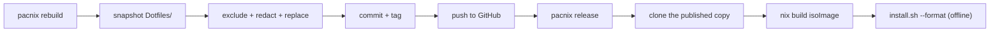
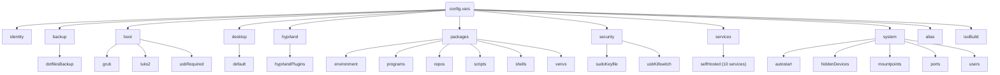

# Dotfiles

> [!WARNING]
> Building or installing without the real password hash file (`/etc/nixos-secrets/`) silently falls back to a known hash for the password **changeme** instead of failing (`Nixos/modules/system/users/users.nix`). Applies to `install.sh --format`/`--setup` and any fresh live-ISO install. Run `secrets passwd` right after first boot, then rebuild.

My NixOS system, flake-managed and fully reproducible. `nixos-rebuild switch` is the only install step that matters -- everything else here is symlinked, generated, or scripted into place from this repo.

```sh
sudo ln -s ~/Dotfiles /etc/nixos   # (or just run ./install.sh --setup)
nixos-rebuild switch --flake /etc/nixos#herauxvalle
```

**Contents:** [Live-install ISO](#live-install-iso) &middot; [What's actually in here](#whats-actually-in-here) &middot; [Configuration](#configuration) &middot; [Layout](#layout) &middot; [A few things worth knowing](#a-few-things-worth-knowing) &middot; [Line counts](#line-counts)

## Live-install ISO

No NixOS, no personal config, no account, no prior clone -- just [Nix](https://nixos.org/download) (flakes enabled, `x86_64-linux`):

```sh
curl -fsSL https://raw.githubusercontent.com/HerauxValle/nixos/main/install.sh | bash -s -- --build-iso
```

Clones into a tmp dir, builds, drops the finished `.iso` in `~/Downloads`. Already have this repo cloned? `./install.sh --build-iso` does the same thing.

## What's actually in here

Real tools this setup is built around, not just static config.

### pacnix

*Day-to-day CLI -- [`Scripts/Pacnix/`](Scripts/Pacnix/)*

| Command | Does |
|---|---|
| `rebuild [--label]` | `sudo nixos-rebuild switch` |
| `validate` | dry-build, no switch |
| `check` | `nix flake check`, fast eval-only |
| `test-build` | full build, no switch, no sudo |
| `published` | dry-builds the actual redacted GitHub copy, not the local checkout |
| `release` | builds the live-install ISO from the published copy |
| `install` | run inside the booted ISO -- format + `nixos-install` |
| `optimise`, `orphaned`, `store` | Nix store housekeeping |
| `packages`, `plugins`, `modules`, `logs`, `info` | introspection |

`published` catches what `test-build` structurally can't: a redaction/replacement entry that leaves the published copy broken while the local flake, which still has every real value, builds fine.

### Hyprland

*[`Hyprland/`](Hyprland/)*

Config is Lua, not raw Hyprlang. `hyprland.lua` requires one file per concern, in numbered sections:

- **Core** -- env, monitors, input
- **UI** -- theme, workspaces
- **Rules** -- layout, window rules
- **Apps** -- default programs, autostart
- **Binds** -- launchers, general, laptop, media, system, plugins
- **Plugins** -- easymotion, hyprexpo, borders-plus-plus, hyprwinwrap

Plugins are built from git (name/rev/hash declared in config, see below), loaded the same way home-manager's plugin wiring works -- no `hyprpm` involved. Animation and gap tuning is deliberate, not defaults; see [`Documentation/Features/hyprland-kitty-motion-tuning.md`](Documentation/Features/hyprland-kitty-motion-tuning.md).

### MyBar

*[`Quickshell/MyBar/`](Quickshell/MyBar/)*

Custom status bar/shell replacing waybar/eww -- C++ backend, QML frontend, Nix-packaged. Lives at `~/.config/quickshell` as a store symlink, so edits need a rebuild. Icons are `Symbols Nerd Font Mono` glyphs, not an icon theme -- missing that font renders every icon as a tofu box.

### cas (Casket)

*Vault manager -- [`Scripts/Casket/`](Scripts/Casket/), Rust*

> Encrypted vault manager -- LUKS2 image files with optional 2FA keyfile, btrfs snapshots, and safe passphrase rotation.

`create` &middot; `open` &middot; `close` &middot; `delete` &middot; `rename` &middot; `backup` &middot; `shrink` &middot; `passwd` &middot; `encryption` &middot; `toggle` &middot; `info`

### gitctl

*Git push-target registry -- [`Nixos/modules/packages/repos/`](Nixos/modules/packages/repos/)*

| Command | Does |
|---|---|
| `push <name>` | squash-push a registered repo to its remote |
| `release <name> <tag> [changelog]` | push + tag + a real GitHub Release |
| `release rm <name> <tag>` | delete both |

Registry lives in config. Its exclude mechanism is simpler than, and separate from, the dotfiles backup/publish pipeline below -- don't point it at a path with secrets expecting the same scrubbing.

### secrets & ltree

*[`Scripts/Secrets/`](Scripts/Secrets/), [`Scripts/LTree/`](Scripts/LTree/)*

`secrets` rotates root-owned credentials outside the repo: `dotfiles`, `github`, `passwd`, `qbittorrent`, `self-hosted`. `lt` is the directory explorer this README's line counts came from.

### Dotfiles backup/publish

*[`Nixos/modules/backup/dotfiles/`](Nixos/modules/backup/dotfiles/)*

Every `pacnix rebuild` pushes a redacted snapshot of this exact config to GitHub -- username, hostname, MAC, keyfile paths swapped for placeholders. This README is that published copy, not a hand-maintained mirror. Auth is an SSH deploy key, repo-scoped and push-only -- it can't create GitHub Releases; that needs the separate PAT `gitctl release` uses instead.



The local checkout with every real value never leaves the machine -- everything past step C is the redacted copy, including what the live ISO gets built from.

### Sudo via keyfile

*[`Nixos/modules/security/sudo-keyfile/`](Nixos/modules/security/sudo-keyfile/)*

A setuid-root PAM checker wired into `security.wrappers`. Passwordless while a specific USB keyfile drive is mounted, real password otherwise. Enabling it is one block, straight from the real [glossar reference](Nixos/glossar/main/variables.nix):

```nix
sudoKeyfile = {
  enable = false;
  keyfilePath = "/run/media/${username}/VirtualKeys/auth.key";
  secretsDir = secretsBaseDir;
  hashFile = "${secretsDir}/${username}-sudo-keyfile.hash";
  confFile = "${secretsDir}/${username}-sudo-keyfile.conf";
};
```

### Live-install ISO

*[`Nixos/iso.nix`](Nixos/iso.nix), [`Installation/build-iso.sh`](Installation/build-iso.sh)*

Built from the same redacted published copy as `pacnix release`, embedding a snapshot of itself at `/dotfiles` for a fully offline install. A dedicated build flag flips the package list into an allowlist -- nothing ships unless it opts in.

### Self-hosted services

*[`Nixos/modules/services/self-hosted/`](Nixos/modules/services/self-hosted/)*

Ollama, ComfyUI, OpenWebUI, Immich, Jellyfin, Stash, SearXNG, Filebrowser, qBittorrent, Odysseus -- each its own module with a real enable switch.

## Configuration

Every custom option lives under one `config.vars` tree. Schema (`options.vars.*`) and real per-machine values are deliberately separate files, so forking this repo means editing only the values.



<details>
<summary><strong>Full <code>config.vars.*</code> reference</strong> (verified against the live-evaluated option set)</summary>

| Namespace | What it configures | Reference |
|---|---|---|
| `identity` | Central facts -- username, homeDirectory, hostName, networkInterface, secretsBaseDir, stateVersion, timeZone, gitCommitEmail | [`variables.nix`](Nixos/glossar/main/variables.nix) |
| `backup.dotfilesBackup` | GitHub backup/publish -- redaction, tagging, push-on-rebuild | [`variables.nix`](Nixos/glossar/main/variables.nix) |
| `boot.grub` | GRUB theming | [`variables.nix`](Nixos/glossar/main/variables.nix) |
| `boot.luks2` | LUKS unlock via USB keyfile | [`variables.nix`](Nixos/glossar/main/variables.nix) |
| `boot.usbRequired` | USB-gated boot -- powers off if the key's missing | [`variables.nix`](Nixos/glossar/main/variables.nix) |
| `desktop.default` | Dolphin menu, udisks2, polkit, gvfs | -- |
| `hyprland.hyprlandPlugins` | Hyprland plugins built from git (name/url/rev/hash) | [`variables.nix`](Nixos/glossar/main/variables.nix) |
| `packages.environment` | Declarative package installs -- sources, version pinning, flake inputs, ISO allowlist | [`packages.nix`](Nixos/glossar/software/packages.nix) |
| `packages.programs` | Program toggles (fish/hyprland/direnv/nix-ld) -- thin mirrors of native options | -- |
| `packages.repos` | gitctl push-target registry | [`repos.nix`](Nixos/glossar/software/repos.nix) |
| `packages.scripts` | PATH-exposed scripts | [`variables.nix`](Nixos/glossar/main/variables.nix) |
| `packages.shells` | Declarative per-directory dev shells | [`variables.nix`](Nixos/glossar/main/variables.nix) |
| `packages.venvs` | Python venv registry/builder | [`venvs.nix`](Nixos/glossar/software/venvs.nix) |
| `security.sudoKeyfile` | Passwordless sudo via USB keyfile | [`variables.nix`](Nixos/glossar/main/variables.nix) |
| `security.usbKillswitch` | Shutdown-on-USB-removal | [`variables.nix`](Nixos/glossar/main/variables.nix) |
| `services.selfHosted.*` | 10 self-hosted services + ACL-traversal helper | [`glossar/self-hosted/`](Nixos/glossar/self-hosted/), one file per service |
| `system.autostart` | Root-only systemd autostart jobs | [`autostart.nix`](Nixos/glossar/system/autostart.nix) |
| `system.hiddenDevices` | Disk UUIDs hidden from udisks2 | -- |
| `system.mountpoints` | Disk registry/manager | [`mountpoints.nix`](Nixos/glossar/system/mountpoints.nix) |
| `system.ports` | Port-forwarding -- local/onion/router, combinable | [`port-forwarding.nix`](Nixos/glossar/system/port-forwarding.nix) |
| `system.users` | Account password hash | -- |
| `alias` | Shortcuts for deeply-nested vars.* paths | [`alias.nix`](Nixos/modules/alias.nix) |
| `isoBuild` | Flips the package list into ISO allowlist mode | [`iso.nix`](Nixos/iso.nix) |

Every file under [`Nixos/glossar/`](Nixos/glossar/) is a real, copy-pasteable example -- every option for that module, commented out, never imported/evaluated. Copy a block into `Nixos/config/config.nix` (or the relevant sibling) and uncomment to set it.

</details>

## Layout

| Path | What lives there |
|---|---|
| [`Nixos/`](Nixos/) | System + home-manager config -- `configuration.nix`, `home.nix`, `iso.nix`, [`modules/`](Nixos/modules/), [`config/`](Nixos/config/), [`glossar/`](Nixos/glossar/) |
| [`Hyprland/`](Hyprland/) | Window manager config (Hyprlang + a Lua layer) |
| [`Quickshell/MyBar/`](Quickshell/MyBar/) | Custom status bar & shell, Nix-packaged, C++ backend + QML |
| [`Scripts/`](Scripts/) | pacnix, Casket (vault), LTree (`lt`), Sudo (broker), Secrets, Backup, Wallpaper, Reload, ... |
| [`Themes/`](Themes/) | Kvantum, QT, Dolphin, GRUB, Gwenview, Searxng, Jellyfin |
| [`Neovim/`](Neovim/), [`Kitty/`](Kitty/), [`Fastfetch/`](Fastfetch/), [`Shells/`](Shells/), [`Mpv/`](Mpv/) | The usual dotfiles suspects |
| [`Python/`](Python/) | Lockfiles for self-hosted services (ComfyUI, OpenWebUI, Odysseus, SearXNG, ...) |
| [`Installation/`](Installation/) | `setup.sh`, `format.sh` (disko), `build-iso.sh` -- all dispatched through `install.sh` |
| [`Backup/`](Backup/) | Snapshots of live, non-Nix-manageable app state |
| [`Documentation/`](Documentation/) | Bugfix and feature writeups worth keeping around |
| [`Conventions.md`](Conventions.md), [`TODO.md`](TODO.md), [`LICENSE`](LICENSE) | Repo-level notes and the Apache 2.0 text |

## A few things worth knowing

- `pacnix rebuild` is the day-to-day command, not raw `nixos-rebuild`.
- Passwordless sudo while a keyfile USB (`VirtualKeys`) is plugged in.
- MyBar lives under `~/.config/quickshell` as a Nix-store symlink -- edits need a rebuild to go live.
- `install.sh --setup` is safe to re-run; it only symlinks `/etc/nixos` and seeds the initial password. `install.sh --format` is separate and destructive -- disk partitioning via disko for a genuinely fresh install.
- `gitctl release`'s push step is not redaction-aware. This repo's own GitHub copy goes out exclusively through the dotfiles backup/publish pipeline above, never through gitctl.

Tuned for my machine (hostname, hardware, keyfile paths), but nothing's hardcoded beyond config and variables -- fork it and swap those to make it yours.

## Line counts

`Nixos/`, `Quickshell/`, and `Hyprland/`, build artifacts/caches/vendored binaries excluded:

| Directory | Lines | Files | Chars |
|---|---:|---:|---:|
| `Nixos/` | 27,185 | 333 | 1,216,406 |
| `Quickshell/` | 13,039 | 82 | 743,455 |
| `Hyprland/` | 1,642 | 37 | 68,357 |
